# Práctica 2 - Instalación de la maquina iaas

Estudiante **Laura Manzini**

**alu0101531700@ull.edu.es**

_Nota_ : la instalación de la maquina iaas será aplicada a un sistema operativo Windows 10

# Indice
### [1. Introdución](#introdución)
### [2. Instalación de homebrew](#homebrew)
### [3. Instalación de git](#git)
### [4. Configuración de GitPrompt](#gitPrompt)
### [5. Git Aliases](#gitAliases)
### [6. Instalación de hub](#hub)
### [7. Instalación de nvm y extensiones](#nvm)
### [8. Instalación de rvm](#rvm)
### [9. Instalación de NERDTree](#nerdtree)
### [10. Instalación de Express](#express)


<a name = "introdución"><a>
## 1. Introdución

La infraestructura como servicio (IaaS) es un método para ofrecer funcionalidades de computación, almacenamiento, redes y de otros tipos a través de Internet.


<a name = "homebrew"><a>
## 2. Instalación de homebrew

Para instalar [**Homebrew**](https://brew.sh/index_es) se utiliza el siguiente codigo sobre la maquina virtual.

`/bin/bash -c "$(curl -fsSL https://raw.githubusercontent.com/Homebrew/install/HEAD/install.sh)"`

Ejecutando este codigo será posible instalar homebrew sobre la maquina de iaas.

<a name = "git"><a>
## 3. Instalación de git

Para descargar la aplicación de git sobre la maquina virtual se ejecuta el codigo `sudo apt install git` y para comprobar la versión currente del git se utiliza `git --version`.

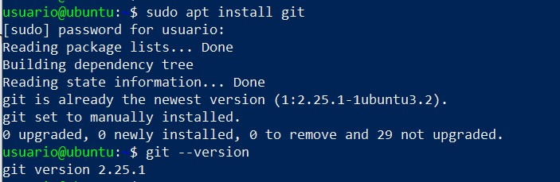

Luego se configura el usuario sobr ela maquina virtuál como sigue:

```
git config --global user.name "Laura Manzini"
git config --global user.mail "232566@studenti.unimore.it"
```

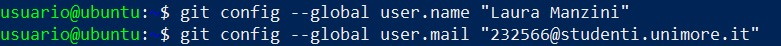

Es necesario crear una clave de ssh para acceder a su proprio perfil de git.

Creando una *clave ssh* (se utiliza un Secure Shell Protocol) sobre GitHub se puede proteger la cuenta de GitHub cuando se esa se utiliza sobre network inseguro. Para más informaciónes se consulte la [guía de GitHub a el utilizo de la clave ssh](https://docs.github.com/en/authentication/connecting-to-github-with-ssh).

`ssh-keygen -t rsa -b 4096 -C  "232566@studenti.unimore.it"`

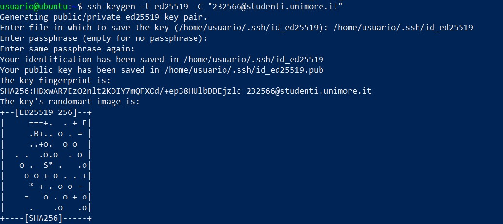

Ahora es posible acceder a la llave privada que es guardada nel file *.pub*. Para accedere a este fichero utilizamos el comando `cat`.

```
cd ~/.ssh
cat id_ed25519.pub
```
Una vez que obtenimos nuestra llave publica podemos copiarla y incolarla sobre la pagína dedicata a las llave ssh en GitHub.

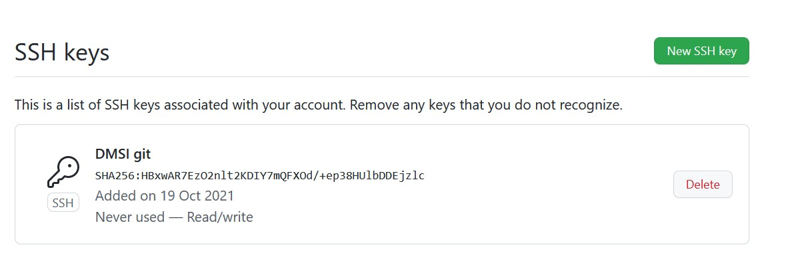

<a name = "gitPrompt"><a>
## 4. Configuración de GitPrompt

El siguiente paso es hacer la configuración de GitPrompt. Para hacer este es necesario seguir [las instrucciones](https://github.com/git/git/blob/master/contrib/completion/git-prompt.sh) que git ofrece. 

Los comandos que necesitamos para pasar de un ambient bash a un ambiente zsh sono los siguientes:

```
#Bash: 
PS1='[\u@\h \W$(__git_ps1 " (%s)")]\$ '
```

```
#ZSH:  
setopt PROMPT_SUBST ; PS1='[%n@%m %c$(__git_ps1 " (%s)")]\$ '
```

<a name = "gitAliases"><a>
## 5. Configuración de Git Aliases

En GitHub puede ser muy util la creación de _aliases_. Un alias es una **schortcut** que te permite de acceder a comandos frecuentemente utilizados de manera más rapida.

Se pueden configurar todos los alias que el usuario quiere po ejemplo 

`git config --global alias.st status`

Con este codigo indicamos que en vez de utilizar el comando `status` solo podemos escirbir `st`.


<a name = "hub"><a>
## 6. Instalación de hub

El `hub` es un comando que puede facilitar el utilizo de git añadendo funcionalidades. El comando se instala ejecutando `sudo apt install hub` y una vez que la instalación será completada comprobamos la versión actual a través de `hub --version`.

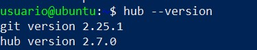

<a name = "nvm"><a>
## 7. Instalación de nvm y extensiones

El `**nvm**` es un administrador de versiones: el acronomo significa **Node Version Manager** y como el nombre sugiere es una herramienta para controlar y cambiar los nodos del repositorio.

Para instalar nvm usamos el siguiente codigo:

` wget -qO- https://raw.githubusercontent.com/nvm-sh/nvm/v0.38.0/install.sh | bash `

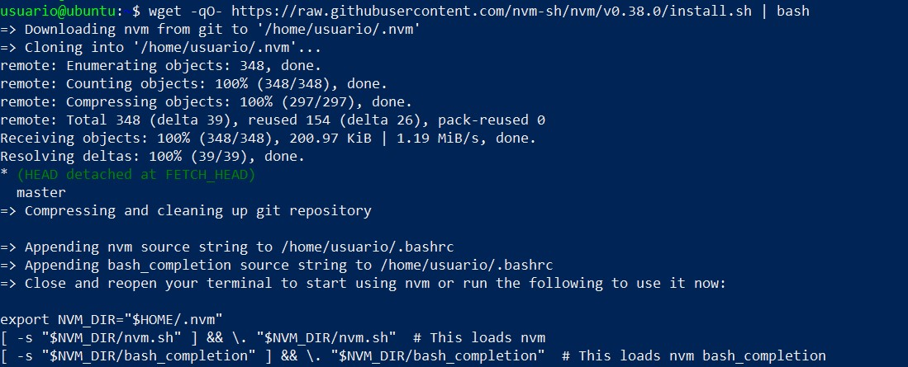

Instalamos ahora la extención de `**nodeJs**` a través de `sudo apt install nodejs`. 
El nodeJs es una herramienta para detectar errores en el funcionamiento de código JavaScript.

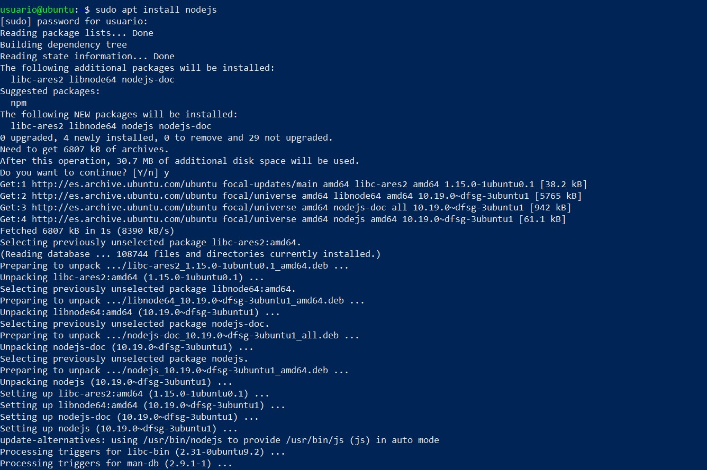

Si comprueba la version currente de nodejs instalada a través de `node --version`

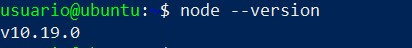

Se sigue instalando `**ExpressJs**` ejecutando `sudo apt install npm` y comprobamos la versión instalada a través de `npm --version`


<a name = "rvm"><a>
## 8. Instalación de rvm

`**rvm**` es un comando para instalar y modificar el trabjo hecho en el entorno de ruby. Para instalar rvm se ejecuta  `sudo apt-get install software-properties-common`.

Sucesivamente se instala el paquete de instalación de rvm:

```
sudo apt-add-repository -y ppa:rael-gc/rvm
sudo apt-get update
sudo apt-get install rvm
```
Para instalar en modo correcto rvm es necesario se deje el aceso a los usuario que utilizar la herramienta:

`sudo usermod -a -G rvm $laura`

Se reinicia la maquina y se consigue que rvm fue instalado con éxito ejecutando `rvm --version`.

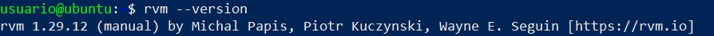

Luego se procede a instalar `**ruby**` a través de rvm:

```
rvm user gemsets
rvm install ruby
```

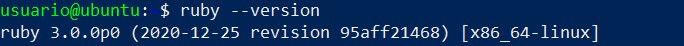

<a name = "nerdtree"><a>
## 9. Instalación de NERDTree

`**NERDTree**` es un gestor de archivios que permite de navigar sobre diferentes ficheros. Para obtener más información sobre cómo instalar la herramiente seguir el siguiente [enlace](https://github.com/preservim/nerdtree).

Para instalar NERDTree es necesario verificar si disponemos de VIM 8.0 o una versión superior:

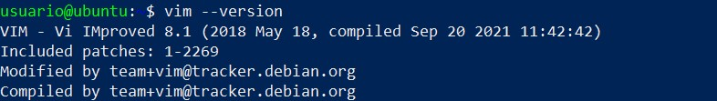

Una vez que hemos combrobado este si puede seguir ejecutando el seguiente codigo sobre la maquina virtual:

```
git clone https://github.com/preservim/nerdtree.git ~/.vim/pack/vendor/start/nerdtree
vim -u NONE -c "helptags ~/.vim/pack/vendor/start/nerdtree/doc" -c q
```

<a name = "express"><a>
## 10. Instalación de Express
`**Express**` es un *web framework*, escrito en JavaScript y alojado en el entorno de ejecución de Node.js.


<a name = ""><a>
## 11.


