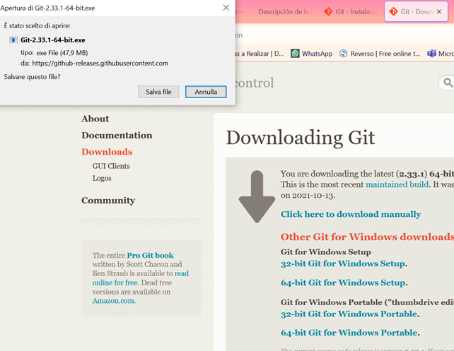
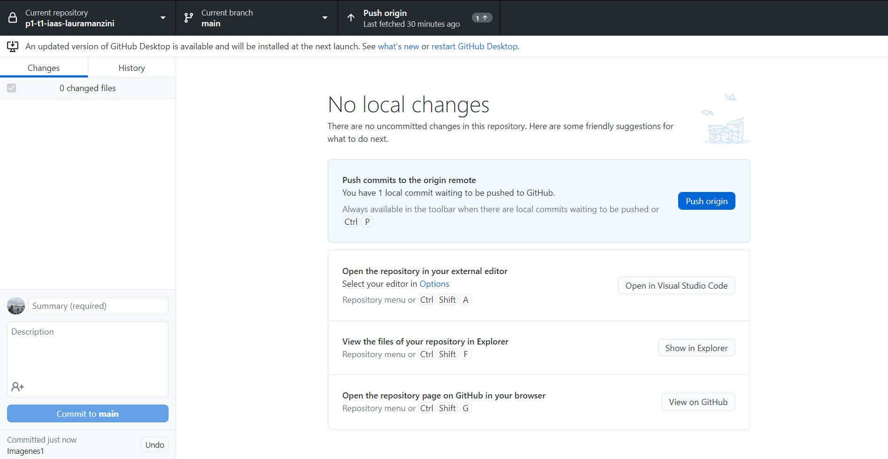
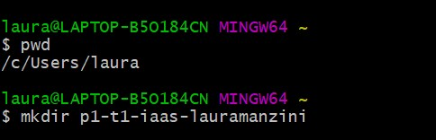
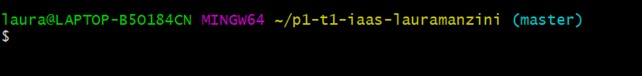

# Práctica 2 - Instalación de la maquina iaas

Estudiante **Laura Manzini**

**alu0101531700@ull.edu.es**

_Nota_ : la instalación de la maquina iaas será aplicada a un sistema operativo Windows 10

# Indice
### [1. Introdución](#introdución)
### [2. Instalación de homebrew](#homebrew)
### [3. Instalación de git](#git)
### [4. Configuración de GitPrompt](#gitPrompt)
### [5. Git Aliases](#gitAliases)
### [6. Instalación de hub](#hub)
### [7. Instalación de RVM y Ruby]()
### [8.]()
### [9.]()

<a name = "introdución"><a>
## 1. Introdución

La infraestructura como servicio (IaaS) es un método para ofrecer funcionalidades de computación, almacenamiento, redes y de otros tipos a través de Internet.


<a name = "homebrew"><a>
## 2. Instalación de homebrew

Para instalar [Homebrew](https://docs.brew.sh/Installation#untar-anywhere) sobre una maquina que utiliza el sistema operativo Windows 10 se utiliza el siguiente codigo sobre la maquina virtual.

```
mkdir homebrew && curl -L https://github.com/Homebrew/brew/tarball/master | tar xz --strip 1 -C homebrew
```


<a name = "git"><a>
## 3. Instalación de git

Para descargar la aplicación de git sobre un sistema operativo Windows 10 es necesario seguir las indicaciones que hay sobre el [sitio oficiál de git](http://git-scm.com/download/win).

)

Siguiendo las instrucciones de git se seguirá instalando la aplicación de git sobre la maquina y luego se podrá sincronizar la aplicación con la cuenta creada sobre [GitHub](https://github.com/).

Al final sobre git aparecerá como sigue:



 Se puede ver como la aplicación se sincronizó correctamente sobre la maquina y al mismo tempo el la cuenta del usuario ya está sincronizada a la maquina.

Utilizando la aplicación de **Git Bash** que GitHub Desktop instaló se puede acceder al terminal a través de lo que se puede comprobar la version corrente de git instalada sobre la maquina.

 


<a name = "gitPrompt"><a>
## 4. Configuración de GitPrompt

El siguiente paso es hacer la configuración de GitPrompt. Para hacer este es necesario seguir [las instrucciones](https://github.com/git/git/blob/master/contrib/completion/git-prompt.sh) que git ofrece.

En primero podemos crear un repositorio en nuestra maquina  como se muestra a continuación




A través del comando `git init` inicializiamos el repositorio a git y luego podemos ver como este repositorio va a ser el **master node**.



A través del comando `PS1: PS1="\$(git branch 2>/dev/null | sed -n 's/* \(.*\)/\1 /p')$ "` podemos enseñar el branch en lo que estamos trabajando.


<a name = "gitAliases"><a>
## 5. Configuración de Git Aliases

En GitHub puede ser muy util la creación de _aliases_. Un alias es una **schortcut** que te permite de acceder a comandos frecuentemente utilizados de manera más rapida.

Se pueden configurar todos los alias que el usuario quiere po ejemplo 

```
git config --global alias.st status
```

Con este codigo indicamos que en vez de utilizar el comando `status` solo podemos escirbir `st`.

<a name = "hub"><a>
## 6. Instalación de hub

El `hub` es un comando que puede facilitar el utilizo de git añadendo funcionalidades.

Para descargar hub sobre un sistema operativo Windows es necesario en primer lugar descargar **Scoop** a través de PowerShell.


En un segundo momento sobre Git Bash se puede descargar hub.


Hub se puede utilizar en diversas maneras como por ejemplo clonar un repositorio con el siguiente comando:

`hub-clone`

<a name = ""><a>
## 7.

<a name = ""><a>
## 8.

<a name = ""><a>
## 9.
